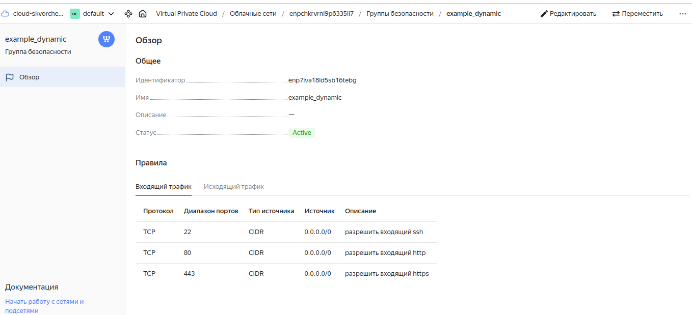

# Домашнее задание к занятию "Управляющие конструкции в коде Terraform"

## Задача 1
Приложите скриншот входящих правил "Группы безопасности" в ЛК Yandex Cloud  или скриншот отказа в предоставлении доступа к preview версии.

## Ответ:
<details>
<summary>terraform apply</summary>

``` sh
[skvorchenkov@localhost src]$ terraform apply

Terraform used the selected providers to generate the following execution plan.
Resource actions are indicated with the following symbols:
  + create

Terraform will perform the following actions:

  # yandex_vpc_network.develop will be created
  + resource "yandex_vpc_network" "develop" {
      + created_at                = (known after apply)
      + default_security_group_id = (known after apply)
      + folder_id                 = (known after apply)
      + id                        = (known after apply)
      + labels                    = (known after apply)
      + name                      = "develop"
      + subnet_ids                = (known after apply)
    }

  # yandex_vpc_security_group.example will be created
  + resource "yandex_vpc_security_group" "example" {
      + created_at = (known after apply)
      + folder_id  = "b1gdgnothmd86ut0ulgu"
      + id         = (known after apply)
      + labels     = (known after apply)
      + name       = "example_dynamic"
      + network_id = (known after apply)
      + status     = (known after apply)

      + egress {
          + description    = "разрешить весь исходящий трафик"
          + from_port      = 0
          + id             = (known after apply)
          + labels         = (known after apply)
          + port           = -1
          + protocol       = "TCP"
          + to_port        = 65365
          + v4_cidr_blocks = [
              + "0.0.0.0/0",
            ]
          + v6_cidr_blocks = []
        }

      + ingress {
          + description    = "разрешить входящий  http"
          + from_port      = -1
          + id             = (known after apply)
          + labels         = (known after apply)
          + port           = 80
          + protocol       = "TCP"
          + to_port        = -1
          + v4_cidr_blocks = [
              + "0.0.0.0/0",
            ]
          + v6_cidr_blocks = []
        }
      + ingress {
          + description    = "разрешить входящий https"
          + from_port      = -1
          + id             = (known after apply)
          + labels         = (known after apply)
          + port           = 443
          + protocol       = "TCP"
          + to_port        = -1
          + v4_cidr_blocks = [
              + "0.0.0.0/0",
            ]
          + v6_cidr_blocks = []
        }
      + ingress {
          + description    = "разрешить входящий ssh"
          + from_port      = -1
          + id             = (known after apply)
          + labels         = (known after apply)
          + port           = 22
          + protocol       = "TCP"
          + to_port        = -1
          + v4_cidr_blocks = [
              + "0.0.0.0/0",
            ]
          + v6_cidr_blocks = []
        }
    }

  # yandex_vpc_subnet.develop will be created
  + resource "yandex_vpc_subnet" "develop" {
      + created_at     = (known after apply)
      + folder_id      = (known after apply)
      + id             = (known after apply)
      + labels         = (known after apply)
      + name           = "develop"
      + network_id     = (known after apply)
      + v4_cidr_blocks = [
          + "10.0.1.0/24",
        ]
      + v6_cidr_blocks = (known after apply)
      + zone           = "ru-central1-a"
    }

Plan: 3 to add, 0 to change, 0 to destroy.

Do you want to perform these actions?
  Terraform will perform the actions described above.
  Only 'yes' will be accepted to approve.

  Enter a value: yes

yandex_vpc_network.develop: Creating...
yandex_vpc_network.develop: Creation complete after 6s [id=enpchkrvrnl9p6335il7]
yandex_vpc_subnet.develop: Creating...
yandex_vpc_security_group.example: Creating...
yandex_vpc_subnet.develop: Creation complete after 1s [id=e9bhgkt9km9nemmi4pe5]
yandex_vpc_security_group.example: Creation complete after 1s [id=enp7iva18ld5sb16tebg]

Apply complete! Resources: 3 added, 0 changed, 0 destroyed.
[skvorchenkov@localhost src]$ cd ../
[skvorchenkov@localhost 03]$ cd ../
[skvorchenkov@localhost ter-homeworks]$ cd ../
[skvorchenkov@localhost ~]$ git clone https://github.com/Mrachneyshiy/terraform-03.git
Клонирование в «terraform-03»…
remote: Enumerating objects: 3, done.
remote: Counting objects: 100% (3/3), done.
remote: Total 3 (delta 0), reused 0 (delta 0), pack-reused 0
Получение объектов: 100% (3/3), готово.
```   
</details>

------

 

## Задача 2

## Ответ:

## Задача 3

## Ответ:

## Задача 4

## Ответ: